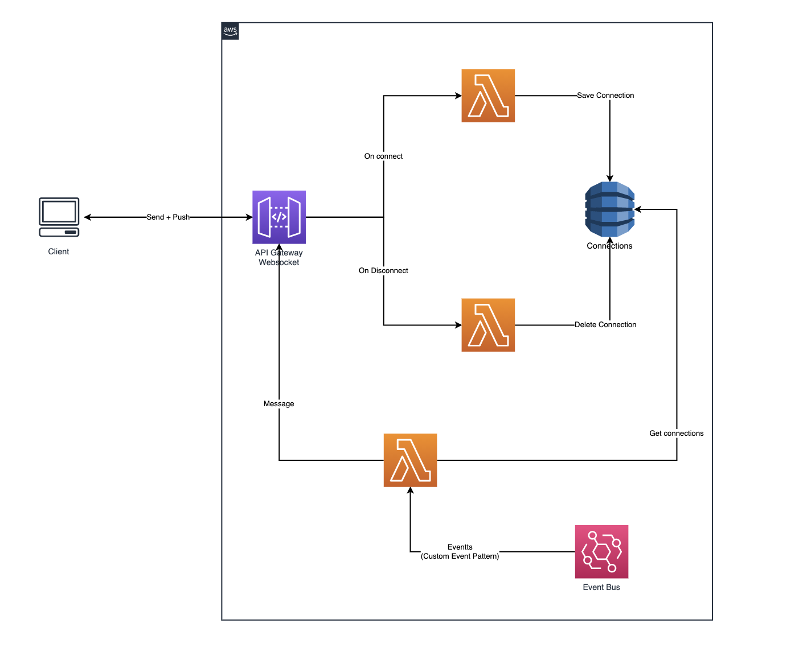

# [cdk-eventbridge-socket](https://boyney123.github.io/cdk-eventbridge-socket/)

This is an AWS CDK Construct that will listen for any EventBridge Bus and Rule and forward that event through a websocket.

**Get setup in seconds and as easy as 7 lines of code.**

### Why

You may want to use tools like [Postman Websockets](https://blog.postman.com/postman-supports-websocket-apis/) or [websocat](https://github.com/vi/websocat) to see and debug what events are being fired through your event bus.

### How

This uses AWS ApiGateway, DynamoDB (to store connections) and Lambda.



## Installation and Usage

### Typescript

```console
npm install --save cdk-eventbridge-socket
```

```typescript
import * as cdk from '@aws-cdk/core';

import { EventBridgeWebSocket } from 'cdk-eventbridge-socket';

export class EventbridgeWebhooksStack extends cdk.Stack {
  constructor(scope: cdk.App, id: string, props?: cdk.StackProps) {
    super(scope, id, props);

    new EventBridgeWebSocket(this, 'sockets', {
      bus: 'your-event-bus-name',

      // This example shows how to listen for all events
      eventPattern: {
        account: ['your_account_id'],
      },
      stage: 'dev',
    });
  }
}
```

When using the `cdk-eventbridge-socket` the new websocket url will be output on your terminal.

## Usage

There are only a few properties you have to set `bus`, `eventPattern` and `stage`.

You can listen to any EventBridge source/pattern you like, just replace the `eventPattern` with what you want to listen to.

#### Examples

##### Listen for a detailType

```typescript
new EventBridgeWebSocket(this, 'sockets', {
  bus: 'your-event-bus-name',

  // Listens for all UserCreated events
  eventPattern: {
    detailType: ['UserCreated'],
  },
  stage: 'dev',
});
```

##### Listen for a source

```typescript
new EventBridgeWebSocket(this, 'sockets', {
  bus: 'your-event-bus-name',

  // Listens for all events on source
  eventPattern: {
    source: ['myapp.users'],
  },
  stage: 'dev',
});
```

##### Secure api with apikey

```typescript
new EventBridgeWebSocket(this, 'sockets', {
  bus: 'your-event-bus-name',

  // Listens for all UserCreated events
  eventPattern: {
    detailType: ['UserCreated'],
  },
  stage: 'dev',
  authentication: true,
});
```

This will create an aws secret in the secretsmanager with the api key used for authentication. The apikey must be added as query param to the api endpoint url `wss://<apiId>.execute-api.<region>.amazonaws.com/<stage>?apiKey=<valueFromSecret>`

You can find more [here on the AWS documentation](https://docs.aws.amazon.com/cdk/api/latest/docs/@aws-cdk_aws-events.EventPattern.html)

# Contributing

If you have any questions, features or issues please raise any issue or pull requests you like. I will try my best to get back to you.

# License

MIT.
